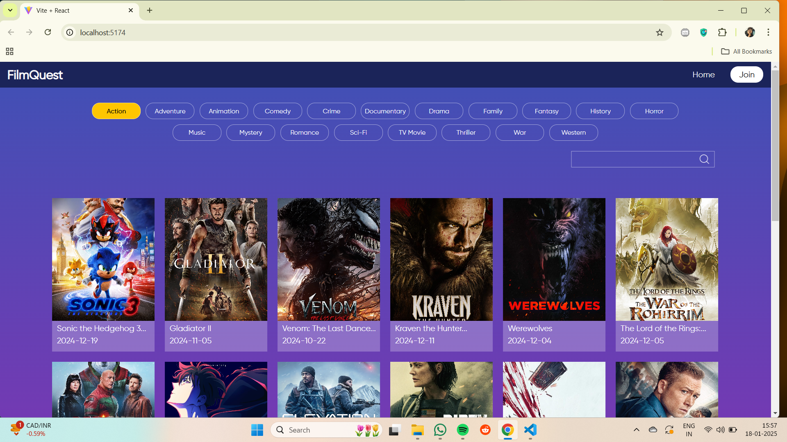
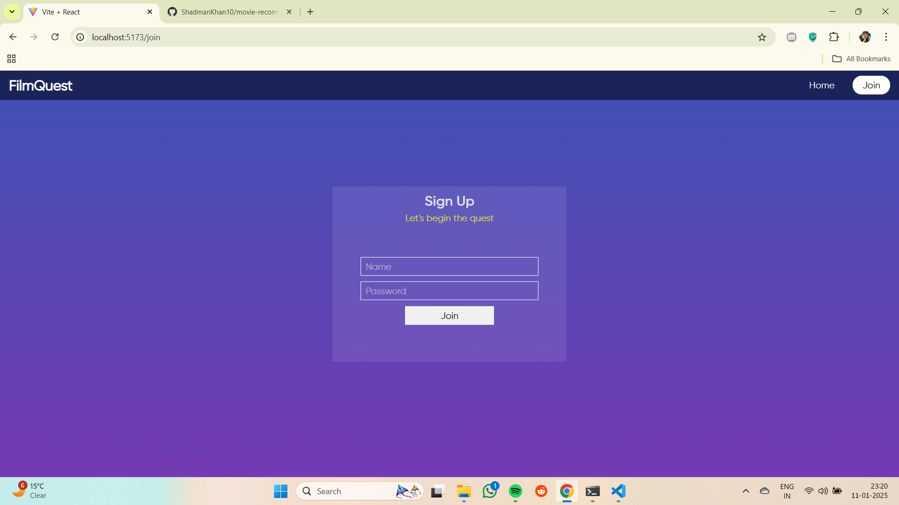
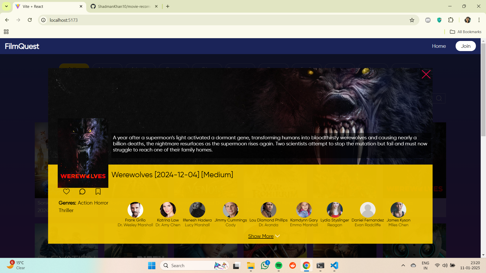

# Astuto Assignment

The app Finds you movies based on your selection of genre.

## Preview

Here are some preview images of the project:





## Getting Started

Follow the steps below to clone, install dependencies, and run the project locally.

### Clone the Repository

```sh
git clone https://github.com/ShadmanKhan10/FilmFactor
npm install
npm run dev
```
